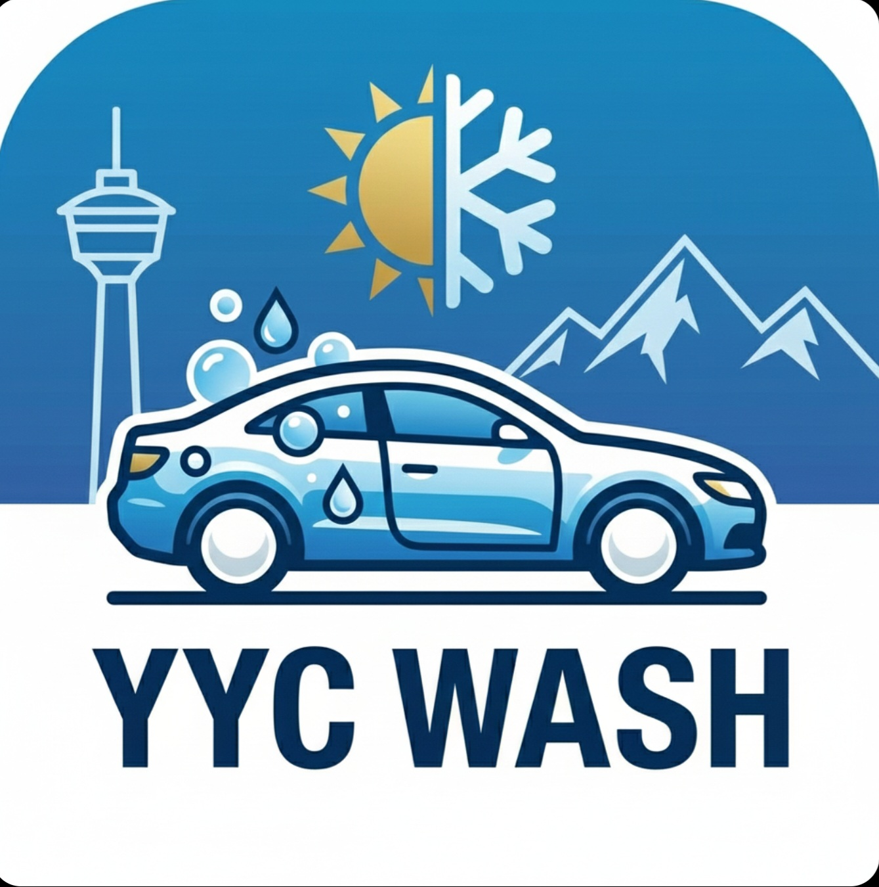

## [yyc-wash](https://cjdulay.github.io/yyc-wash/)

# 🚗 YYC Car Wash Forecaster (WIP)

A specialized weather utility and "thought partner" built for the unique challenges of driving in Calgary, Alberta. This app moves beyond simple temperature forecasts to provide actionable, physics-based advice on vehicle maintenance, road safety, and **Strategic Wash Windows**.

## 📋 Project Overview
Calgary winters are defined by extreme temperature swings (Chinooks), abrasive road treatments ("Pickle"), and high-risk corrosive states. This project translates raw meteorological data into vehicle-specific insights, helping drivers—particularly **Hybrid and EV owners**—navigate the chemistry of the prairies to protect their vehicle's chassis and mechanical longevity.

---

## 🔬 The Physics Lab: Methodology & Operations
The core of this app is a custom logic engine that interprets data from the **Open-Meteo API** through a Calgary-specific lens.

### 1. The 7-Day Strategic Scan
I scan 168 hours of future data to find windows where roads will actually **dry**. I don't just look for sun; I look for the chemical transition from "tacky" brine to dry dust.
* **The Brine Filter (The Tacky Zone):** I automatically skip hours between **-5°C and +2°C**. In this range, road salt becomes a sticky, acidic syrup (Brine) that "wicks" into your chassis and cannot be blown off.
* **Sublimation Hunt:** I prioritize High Wind (>15km/h) and Deep Cold (-8°C or lower). This skips the liquid phase entirely, turning wet salt into a harmless dry powder via **Sublimation**.
* **Melt-Lag Rule:** I factor in a 12–24 hour "Lag" after any snow event to ensure plows have finished and residual "Curb-Melt" has evaporated.

### 2. Corrosion Speedometer (Arrhenius Kinetics)
The app features a live diagnostic tool that calculates the rate of oxidation on your vehicle in real-time.
* **Temperature Doubling:** Based on the **Arrhenius Equation**, the rate of chemical reaction (rust) roughly doubles for every 10°C increase in temperature. 
* **The Garage Trap:** A frozen, salty car parked in a +10°C garage is rusting **10x faster** than one parked outside in the cold.
* **Hygroscopic Effect:** Road salt is hygroscopic, meaning it pulls moisture out of the air. Even on dry days, salt "dust" on your chassis can start corroding if humidity rises.

### 3. The "Ice Cube Effect" (Thermal Lag)
* **The Science:** Steel is a high-density thermal mass. If Calgary was at -20°C overnight, the car's frame remains sub-zero long after the air warms up.
* **The Feature:** The **Drying Window** timer factors in this lag. It tells you exactly how much time you have to hand-dry door seals before the "heat sink" of your frame bonds them shut.

---

## ✨ Personalization & Vehicle Profiles
The app allows users to customize their diagnostic sensitivity through two primary toggles:

* **Hybrid / EV Mode:** Enables specialized alerts for **BMS (Battery Management System)** health. It warns about restricted regenerative braking in the deep cold and tracks "High Voltage" specific maintenance needs.
* **Strict Mode:** Prioritizes paint longevity over a temporary shine. I will only suggest a "GO" window when roads are fully dry to prevent the immediate "Tacky Film" effect.
* **Exposure Score:** A cumulative counter that tracks how many days your vehicle has been exposed to active brine since your last logged wash.

---

## ❄️ Cold Snap Checklist (Insights)
* **PSI Physics:** For every 5°C drop, tires lose ~1 PSI. Check pressure when the "Plug-In" alert is active.
* **Battery Strain:** At -18°C, a standard lead-acid battery loses 40% of its cranking power.
* **Washer Fluid:** Only use -40°C rated fluid. Summer fluids will freeze and crack your reservoir during a Calgary snap.

---

## 📲 Installation (PWA)
This tool is a **Progressive Web App (PWA)**. Install it directly from your browser to your home screen for a full-screen, offline-ready experience.

### iOS (Safari)
1. Tap the **Share** icon.
2. Select **"Add to Home Screen."**

### Android (Chrome)
1. Tap the **three-dot menu**.
2. Select **"Install App"** or **"Add to Home Screen."**

---

## 🛠️ Maintenance Strategy
* **Silicone Rule:** Apply silicone spray to weatherstripping when the Drying Window is < 10 mins.
* **Thermal Shock:** Pre-heat your car before washing in extreme cold to protect the windshield from cracking.
* **Brake Clear:** Firmly engage mechanical brakes after a wash to evaporate moisture and pr
* event rotor seizure.
